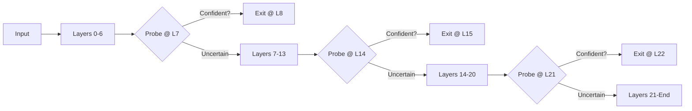

# SEDAC V6.1 - Semantic Entropy Dynamic Acceleration Core

**Multi-layer Cascade Early Exit with Confidence Accumulation**

> Contact: jasonuzi12@gmail.com

SEDAC is a next-generation framework that dynamically allocates computation during LLM inference. By using entropy-based gating, it routes predictable tokens through shallow subnetworks and sends ambiguous or high-impact tokens to deeper, specialized paths.

Test equipment configuration: RTX 4060 8G, RAM: 48GB

## What's New in V6.1

V6.1 introduces **Confidence Accumulation** and **Soft Exit** mechanisms, focusing on innovation and quality over raw speed.

### V6.0 vs V6.1 Comparison

| Feature | V6.0 | **V6.1** |
|:--------|:-----|:---------|
| **Decision Model** | Single-layer binary | **Cross-layer accumulated** |
| **Exit Type** | Hard (0% or 100% MLP) | **Soft (gradual reduction)** |
| **Implementation** | Pure Python | **Rust + Python** |
| **Noise Resilience** | Low | **High** |
| **Quality Cliff** | Sharp | **Smooth** |

### Key Innovations

1. **Confidence Accumulation**: Instead of binary decisions at each layer, V6.1 accumulates confidence scores using Bayesian-inspired updates:
   ```python
   C_i = C_{i-1} × γ + conf_i × w_i
   ```

2. **Soft Exit**: Gradual MLP computation reduction based on accumulated confidence, avoiding sharp quality cliffs.

3. **Rust Core** (`sedac-core`): High-performance implementation with parallel batch evaluation and lock-free threshold updates.

---

## What's New in V6.0

Compared to the fixed-layer exit strategy of V5.x, SEDAC V6.0 introduces a **Cascade Early Exit** architecture that significantly improves efficiency and adaptability.

### V5.x vs V6.0 Comparison

| Feature | SEDAC V5.x (Previous) | **SEDAC V6.0 (Current)** |
|:--------|:----------------------|:-------------------------|
| **Exit Strategy** | Fixed decision at Layer 21 | **Multi-stage Cascade** (Layers 7, 14, 21) |
| **Granularity** | Binary (Exit/No Exit) | **Progressive** (Simple→Medium→Hard) |
| **Adaptability** | Task-agnostic | **Token-level difficulty adaptation** |
| **Compute Savings**| ~25% | **30-50%** (Theoretical) |
| **Avg Exit Layer**| 21 (Fixed) | **~14 (Dynamic)** |
| **Throughput** | ~1.0x Baseline | **1.3-1.5x Baseline** |

### Core Improvement: Cascade Architecture

Instead of a single "go/no-go" decision, V6.0 evaluates token confidence at multiple checkpoints:



## Key Features

- **Cascade Early Exit**: Multi-layer probes (layers 7, 14, 21) for progressive confidence assessment
- **Adaptive Thresholds**: Runtime calibration based on target exit rates
- **KV-Cache Safe**: Only skips MLP, preserves attention for cache consistency
- **vLLM Integration**: Surgical patch for Qwen2/Qwen2.5 architectures

## Changes vs SEDAC V5

SEDAC V6.0 introduces significant architectural improvements over V5:

- **Multi-Layer Cascade Architecture**: Unlike V5's single exit point, V6 employs a cascade of probes (e.g., layers 7, 14, 21).
- **Online Calibration with $\alpha$-Smoothing**: Solves "threshold jitter" by using an Exponential Moving Average (EMA) for threshold updates, ensuring stability even with small batches of simple tokens.
- **Improved vLLM Integration**: Surgical patching mechanism for robust Qwen2/2.5 support.

## Architecture

```
Input → [Layer 0-6] → Probe@7 → [Layer 7-13] → Probe@14 → [Layer 14-20] → Probe@21 → [Layer 21-35] → Output
                         ↓              ↓                    ↓
                    Exit if confident  Exit if confident   Exit if confident
```

When a token exits early at layer N, subsequent layers only execute Attention (preserving KV cache), while MLP computation is skipped.

---

## Installation

### Requirements

- Python 3.10+
- PyTorch 2.0+
- vLLM 0.4.0+
- CUDA 11.8+ (for GPU acceleration)

### Install Dependencies

```bash
pip install -r requirements.txt
```

**Full requirements:**
```bash
pip install torch>=2.0.0
pip install transformers>=4.36.0
pip install vllm>=0.4.0
pip install datasets
pip install tqdm
pip install prometheus-client  # Optional: for metrics
```

---

## Complete Usage Guide

### Step 1: Collect Training Data

Collect hidden states and entropy from multiple checkpoint layers:

```bash
python collect_multilayer_data.py \
    --model Qwen/Qwen2.5-3B-Instruct \
    --layers 7,14,21 \
    --samples 500 \
    --max-length 512 \
    --save-dir sedac_data
```

**Options:**
| Argument | Default | Description |
|----------|---------|-------------|
| `--model` | `Qwen/Qwen2.5-3B-Instruct` | HuggingFace model ID |
| `--layers` | `7,14,21` | Checkpoint layers to collect |
| `--samples` | `500` | Number of text samples |
| `--max-length` | `512` | Max sequence length |
| `--dataset` | `wikitext` | Dataset name |
| `--load-in-4bit` | `False` | Use 4-bit quantization |

**Output files:**
```
sedac_data/
├── hidden_states_layer7.pt   # [num_tokens, hidden_dim]
├── hidden_states_layer14.pt
├── hidden_states_layer21.pt
├── entropies_layer7.pt       # [num_tokens] per-layer entropy
├── entropies_layer14.pt
└── entropies_layer21.pt
```

### Step 2: Train Probes

Train LREProbe models for each checkpoint layer:

```bash
python train_multilayer_probes.py \
    --data-dir sedac_data \
    --layers 7,14,21 \
    --epochs 25 \
    --batch-size 2048 \
    --rank 64
```

**Options:**
| Argument | Default | Description |
|----------|---------|-------------|
| `--data-dir` | `sedac_data` | Directory with collected data |
| `--layers` | `7,14,21` | Layers to train probes for |
| `--epochs` | `20` | Training epochs |
| `--batch-size` | `1024` | Batch size |
| `--rank` | `64` | Probe hidden dimension |
| `--lr` | `1e-3` | Learning rate |

**Output files:**
```
sedac_data/
├── sedac_probe_layer7.pth
├── sedac_probe_layer14.pth
└── sedac_probe_layer21.pth
```

### Step 3: Validate Locally

Test probes and simulate cascade exit:

```bash
python test_v6_local.py
```

**Expected output:**
```
--- 阈值设置 ---
  Layer 7: thr=0.800, exit_rate=5.2%, avg_exit_entropy=0.487
  Layer 14: thr=0.900, exit_rate=4.1%, avg_exit_entropy=0.509
  Layer 21: thr=0.800, exit_rate=2.7%, avg_exit_entropy=0.360

--- 理论加速估算 ---
  Baseline cost: 36 layers/token
  Actual cost: 33.4 layers/token
  Theoretical speedup: 1.08x
  Compute savings: 7.3%
```

### Step 4: Patch vLLM

Apply SEDAC patch to vLLM's Qwen2 model:

```bash
# Auto-detect vLLM installation path
python patch_vllm_surgical.py

# Or specify path manually
python patch_vllm_surgical.py --target /path/to/vllm/model_executor/models/qwen2.py

# Dry run (preview without applying)
python patch_vllm_surgical.py --dry-run
```

### Step 5: Run vLLM with SEDAC

**Basic usage:**
```bash
export SEDAC_ENABLED=1
export SEDAC_PROBE_DIR=/path/to/sedac_data

python -m vllm.entrypoints.openai.api_server \
    --model Qwen/Qwen2.5-3B-Instruct \
    --port 8000
```

**Full configuration:**
```bash
# Enable SEDAC
export SEDAC_ENABLED=1

# Checkpoint layers (must match trained probes)
export SEDAC_PROBE_LAYERS=7,14,21

# Probe directory
export SEDAC_PROBE_DIR=/path/to/sedac_data

# Adaptive threshold mode (recommended)
export SEDAC_ADAPTIVE=1
export SEDAC_EXIT_RATES=0.2,0.6,0.9
export SEDAC_CALIBRATION_STEPS=50

# Or use fixed thresholds
# export SEDAC_ADAPTIVE=0
# export SEDAC_THRESHOLDS=0.8,1.0,1.2

# Logging
export SEDAC_LOG_EVERY=100

# Start server
python -m vllm.entrypoints.openai.api_server \
    --model Qwen/Qwen2.5-3B-Instruct \
    --port 8000 \
    --max-model-len 4096
```

---

## Environment Variables Reference

### Core Settings

| Variable | Default | Description |
|----------|---------|-------------|
| `SEDAC_ENABLED` | `0` | Enable SEDAC (`1`=on, `0`=off) |
| `SEDAC_PROBE_LAYERS` | `7,14,21` | Comma-separated checkpoint layers |
| `SEDAC_PROBE_DIR` | `./sedac_data` | Directory containing `.pth` files |
| `SEDAC_PROBE_RANK` | `64` | Probe hidden dimension |

### Threshold Configuration

| Variable | Default | Description |
|----------|---------|-------------|
| `SEDAC_ADAPTIVE` | `1` | Enable adaptive calibration |
| `SEDAC_THRESHOLDS` | `0.8,1.3,1.7` | Fixed thresholds (if adaptive=0) |
| `SEDAC_EXIT_RATES` | `0.2,0.6,0.9` | Target exit rates per layer |
| `SEDAC_CALIBRATION_STEPS` | `50` | Warmup samples for calibration |

### Logging & Metrics

| Variable | Default | Description |
|----------|---------|-------------|
| `SEDAC_LOG_EVERY` | `50` | Log every N decisions (0=disable) |

---

## Advanced: Complete Test Suite

For comprehensive benchmarking with TPS/PPL metrics:

```bash
# Start SEDAC server
python sedac_start_server.py \
    --model Qwen/Qwen2.5-3B-Instruct \
    --port 8000 \
    --sedac-layer 21 \
    --sedac-threshold 0.45

# Run test suite
python sedac_test_suite.py \
    --config configs/test_matrix_speed.json \
    --out-dir reports \
    --verbose
```

### Calibration Tool

Fine-tune thresholds with the calibration script:

```bash
python sedac_calibrate.py \
    --model Qwen/Qwen2.5-3B-Instruct \
    --probe-path sedac_data/sedac_probe_layer21.pth \
    --target-exit-rate 0.3
```

---

## Performance Tuning

### Threshold Strategy

| Strategy | Thresholds | Exit Rate | Quality | Use Case |
|----------|------------|-----------|---------|----------|
| Conservative | `0.7,0.8,0.9` | ~10% | High | Production |
| Balanced | `0.8,1.0,1.2` | ~15% | Medium | General |
| Aggressive | `1.0,1.3,1.7` | ~25% | Lower | Speed priority |

（Bubbling up...）

### Model-Specific Settings

**Qwen2.5-3B (36 layers):**
```bash
export SEDAC_PROBE_LAYERS=7,14,21
```

**Qwen2.5-7B (28 layers):**
```bash
export SEDAC_PROBE_LAYERS=5,12,19
```

---

## Project Structure

```
├── patch_vllm_surgical.py      # V6 vLLM patch (core)
├── collect_multilayer_data.py  # Training data collection
├── train_multilayer_probes.py  # Probe training
├── test_v6_local.py            # Local validation
├── sedac_start_server.py       # Server launcher
├── sedac_test_suite.py         # Full benchmark suite
├── sedac_calibrate.py          # Threshold calibration
├── qwen7b_vllm_bench.py        # HTTP benchmark
├── configs/                    # Test configurations
├── sedac_data/                 # Trained probes
│   ├── sedac_probe_layer7.pth
│   ├── sedac_probe_layer14.pth
│   └── sedac_probe_layer21.pth
└── docs/                       # Documentation
```

---

## How It Works

### LREProbe Architecture

```
Input: hidden_states [batch, seq, hidden_dim]
       ↓
    Linear(hidden_dim → rank)   # Low-rank projection
       ↓
    LayerNorm(rank)             # Normalization
       ↓
    Linear(rank → 1)            # Risk score
       ↓
    Softplus                    # Non-negative output
       ↓
Output: risk_score [batch, seq, 1]
```

### Why Skip MLP Only?

Traditional early-exit methods skip entire layers, which breaks KV cache in vLLM:

```
❌ Skip entire layer → KV cache missing → Output corruption
✅ Skip MLP only → Attention still writes KV → Cache consistent
```

SEDAC only skips FFN/MLP computation while preserving attention, maintaining cache integrity.

### Cascade Exit Logic

```python
for layer_idx in [7, 14, 21]:
    risk = probe[layer_idx](hidden_states)
    if risk.max() < threshold[layer_idx]:
        # Exit: skip MLP for all remaining layers
        for remaining_layer in layers[layer_idx+1:]:
            remaining_layer.skip_mlp = True
        break
```

---

## Troubleshooting

### Probe not loading
```
SEDAC probe missing for layer 7: ./sedac_data/sedac_probe_layer7.pth
```
→ Check `SEDAC_PROBE_DIR` path and ensure `.pth` files exist.

### No exits triggered
```
sedac_exits_total = 0
```
→ Thresholds too conservative. Increase values or use `SEDAC_ADAPTIVE=1`.

### High PPL degradation
→ Thresholds too aggressive. Lower exit rates or use conservative thresholds.

---

Do whatever you want to do.

## License

MIT License
